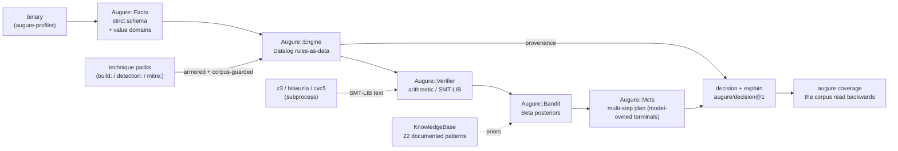

# augure


**The auditable exploitation decision layer.**

> *Augur (n.): a Roman official who read the signs, announced the strategy,
> and kept the record. Before any legion moved, someone had to decide -
> and account for the decision.*

---

[](https://github.com/log0u7/augure/actions/workflows/ci.yml)
[](https://rubygems.org/gems/augure)
[](https://www.ruby-lang.org/)
[](LICENSE)

Every exploitation framework answers *"how do I run this technique?"*.
**Augure answers the question nobody automates: *"which technique should run,
and why - provably?"***

An LLM will confidently recommend `ret2libc` against a target with no libc,
because it generates text, not proofs. Augure generates proofs, not text:

- **Propose** - Datalog rules over the target's fact base select every
  applicable technique. Decidable, terminating, readable.
- **Verify** - arithmetic and SMT-LIB checks confirm the selected technique
  is *numerically feasible*, not merely logically applicable.
- **Explain** - every decision ships with its provenance: every rule that
  fired (siblings included, each attributed), the facts that justified it,
  the Beta prior and the seeded draw that ranked it.
  Same input + same seed = same decision. Always.

## Why it exists

When an exploit developer picks a technique - *"this is a ret2libc situation"* -
that pick is a **heuristic**, and heuristics are local optima: fast, usually
right, never systematically tested. Augure is the test rig for those local
optima. Run your intuition against the frozen CTF corpus and watch the
weight inversions: humans overweight shellcode and `ret2libc`; the data
underweights them. `ret2plt` - the boring, reliable one - was massively
underrated.

That is the product. Not autonomy. **Accountability.**

## Quickstart

```sh
gem install augure
augure doctor                              # verify the environment
augure analyze examples/ret2win.facts      # your first decision
```

(The `examples/` ship in the gem; in a repo checkout the same paths work
from the repo root. Not published yet? The sibling lictor checkout
resolves augure by path - its Gemfile says so.)

Profile a real binary into facts, then decide on them:

```sh
augure-profile app.elf -o target.facts   # gem augure-profiler (metasm)
augure analyze target.facts
```

```sh
$ augure analyze target.facts
applicable: ret2plt, rop
selected:   ret2plt
plan:       ret2plt
  ret2plt <- app_ret2plt (vuln=sof, nx=true, pie=false, plt=system)
  rop <- app_rop (vuln=sof, nx=true, enough_gadgets=true)
```

Or the machine-readable form:

```console
$ augure analyze target.facts --json
{
  "schema":     "augure/decision@1",
  "applicable": ["ret2plt", "rop"],
  "ranking":    ["ret2plt", "rop"],
  "verified":   { "ret2plt": { "status": "sat", "checks": { "payload_fits": "sat" } },
                  "rop":     { "status": "sat", "checks": { "payload_fits": "sat" } } },
  "selected":   "ret2plt",
  "plan":       ["ret2plt"],
  "explain": {
    "provenance": {
      "ret2plt": [{ "rule": "app_ret2plt", "origin": null,
                    "evidence": [["vuln", "sof"], ["nx", "true"], ["pie", "false"], ["plt", "system"]] }]
    }
  }
}
```

From Ruby:

```ruby
require "augure"

result = Augure::Pipeline.analyze(facts: File.read("target.facts"), seed: 42)

result[:selected]          # => "ret2plt"
result[:explain]           # => { provenance: { "ret2plt" => [{ rule:, origin:, evidence: [...] }] } }
```

## What is in the box

| Layer | Module | What it does |
|---|---|---|
| Facts | [`Augure::Facts`](docs/reference.md#fact-format) | Strict, schema-checked fact parser. Malformed input fails loudly, never silently. |
| Rules | [`Augure::Rules`](docs/how-to-write-rules.md) | Rules-as-data: the single source of truth for applicability. |
| Engine | [`Augure::Engine`](docs/reference.md#augureengine) | Forward-chaining evaluation with per-decision provenance. |
| Verifier | [`Augure::Verifier`](docs/reference.md#augureverifier) | Arithmetic fast path + SMT-LIB emission. |
| Solvers | [`Augure::SmtProcess`](docs/how-to-swap-solver.md) | Subprocess boundary to z3 / bitwuzla / cvc5. Timeout = `:unknown`, never a crash. |
| Knowledge | [`Augure::KnowledgeBase`](docs/reference.md#augureknowledgebase) | 22 documented exploitation patterns; TF-IDF retrieval; Beta prior calibration. |
| Bandit | [`Augure::Bandit`](docs/reference.md#augurebandit) | Thompson sampling over Beta posteriors, seeded and auditable. |
| Planner | [`Augure::Mcts`](docs/reference.md#auguremcts) | Multi-step planning: a leak is worth what it unlocks. |
| CLI | [`exe/augure`](docs/tutorial.md) | Facts in, decision out, JSON if you want it. |

**Zero runtime dependencies.** Every external capability (SMT
solvers, LLM providers) enters through a subprocess or HTTP boundary.

## How the decision flows



## Honest numbers

Augure's decision engine reproduces the frozen CTF benchmark corpus
byte-for-byte - **33/33** technique classifications across ROP Emporium,
Protostar, Phoenix and pwnable-style targets (16 built-in technique
heads plus the 20 taught technique packs),
and 5/5 multi-step plans including an externally documented kernel chain.
CI runs [`augure-benchmark`](docs/reference.md#cli) and fails the build below 100%.

Read that carefully: these are **predictions against frozen ground truth**,
not field results. The success probabilities in the prior table are
*authored, not measured*. Augure is an auditable decision layer, and the
audit begins with this sentence.

| Claim | Evidence |
|---|---|
| 33/33 classification parity | `lib/augure/ctf_corpus.json`, `spec/augure/engine_spec.rb` |
| 5/5 plan parity (incl. PinTheft kernel chain) | `spec/augure/mcts_spec.rb` |
| Ruby engine == frozen Python engine | corpus conformance specs, CI-enforced |

## Why not just ask an LLM?

| | LLM alone | Augure |
|---|---|---|
| recommends `ret2libc` with no libc | confidently | structurally impossible (a rule forbids it) |
| explains *why* | plausible prose | rule ID + facts + checks + seeded draw |
| reproducible | no | same seed, same decision |
| terminates | usually | provably (Datalog) |
| audit trail | chat log | machine-checkable provenance |

They compose: an LLM proposes hypotheses, Augure disposes. That is the
generate-then-verify pattern the planning literature names LLM-Modulo
(Kambhampati et al., ICML 2024) and that CHECKMATE (Wang et al., 2025)
measured at +20% penetration success. The shipped **augure-mcp** gem
exposes exactly that read-only surface (analyze_target, list_rules,
explain_technique) to agents.

## Acceptable use

Augure is a **decision layer**. It contains no exploit code, executes
nothing, and touches no target. It encodes technique *metadata* - rules,
facts, feasibility checks - the same class of knowledge as a public
write-up. Use it for:

- security research, CTF preparation and training;
- red-team engagement planning where you are authorized to operate;
- defensive analysis: the same model read backwards tells you which
  techniques your estate makes impossible.

Do not use it to attack systems you do not own or are not explicitly
authorized to test.

## License

MIT. The `augure-profiler` gem depends on metasm, LGPL-2.1, used as an
external library in the readline style.

## Documentation

The architectural renouncements and deferrals are recorded as ADRs in
[docs/adr/](docs/adr/): the arch abstraction before any port (0001), ARM64
deferred behind it (0002), PE/Windows out of scope for v0.x (0003).

| I want to... | Read |
|---|---|
| get my first decision in 10 minutes | [the tutorial](docs/tutorial.md) |
| see what hardening kills (the blue scorecard) | `augure coverage --flip canary:true` |
| align with ATT&CK (purple) | `augure rules --mitre --packs packs --json` |
| write my own technique rules | [rule-writing how-to](docs/how-to-write-rules.md) |
| teach augure a technique (packs) | [the pack format](docs/pack-format.md) |
| read the published lineage and where this project stands on it | [build-format](docs/build-format.md) |
| plug a real SMT solver | [solver how-to](docs/how-to-swap-solver.md) |
| look up the fact format or API | [the reference](docs/reference.md) |
| understand auditability (red/blue/purple) | [auditability](docs/auditability.md) |
| understand why rules-as-data | [architecture](docs/explanation-architecture.md) |
| brief an LLM agent on the pair | [the agent snippet](docs/agent-snippet.md) |
