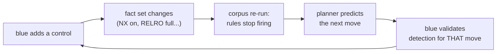

# Auditability: what it means, and what it costs each team

*Explanation. This page is the "why" behind the `explain` payload.*

## What auditability means here

Every decision Augure produces is a set of readable proofs, not a score:

```json
{
  "selected": "ret2plt",
  "explain": {
    "provenance": {
      "ret2plt": [{
        "rule": "app_ret2plt",
        "evidence": ["vuln=sof", "nx=true", "pie=false", "plt=system"]
      }]
    }
  }
}
```

Three properties fall out of that shape:

1. **Traceability.** Every technique claim points to a rule ID and the exact
   facts that satisfied it. Nothing is a vibe.
2. **Reproducibility.** The bandit's draw is seeded. Same facts, same seed,
   same decision - re-runnable years later, in front of a client, in front
   of an auditor.
3. **Disprovability.** A wrong rule is a *findable* wrong rule. When Augure
   disagrees with your intuition, you can locate the disagreement precisely:
   which fact was missing, which condition is too narrow. That disagreement
   is a bug report or a research result - never a shrug.

The original system's motto still applies: *one is a clock, the other is a
cat*. An LLM agent improvises; a clock ticks the same way every time. You
can open a clock.

## For red team: the defensible choice

An engagement report that says *"we chose ret2plt because the model said
so"* does not survive client scrutiny. One that says *"ret2plt was selected
by rule `app_ret2plt` because the binary imports `system@plt`, PIE is off,
and the pop-rdi gadget is present; the chain passed the payload-fit check"* -
does.

Concretely, red teams get:

- **Methodology you can defend.** The explain block drops into the report as
  evidence, per target.
- **After-action replay.** Same facts + same seed = same decision. Re-run
  last quarter's engagement against the current rules and see exactly what
  the rule updates changed.
- **Benchmarked intuition.** The prior table encodes measured weight
  inversions: human operators overweighted shellcode and `ret2libc` and
  underweighted `ret2plt`. Your team can measure its own priors the same
  way - and the disagreement with Augure's corpus is itself signal.

The honest boundary: the priors are **authored, not measured on your
targets**. Treat Augure's recommendation as a falsifiable hypothesis that
happens to carry its own proof trail - not as an oracle.

## For blue team: the model read backwards

The same fact/rule table, read in reverse, is a hardening map:

- **Coverage mapping.** "Which techniques does our estate make
  *impossible*?" A rule fires only if its facts hold. `app_shellcode`
  requires NX off - flip the fact, the rule dies. Enumerate which
  protections kill which rules, per asset class.
- **Hardening prioritization.** Each control eliminates a set of rules. The
  control that kills the most rules on your asset mix is your best next
  spend - computable, because the model is explicit.
- **Anti-reflex prediction.** The corpus's discriminating cases
  (`stack6`/`stack7`-style: filtered return addresses) show what an
  *adaptive* attacker does when the obvious technique dies: it plans the
  boring alternative. Blue teams can run the same planner on their own
  fact base to see the second-order moves.
- **Reconnaissance signatures.** Every fact a rule needs is something an
  attacker must *learn* first: `plt("system")`, `gadget("pop_rdi_ret")`,
  `glibc_minor`. The fact list is a detection surface: what your monitoring
  should catch someone enumerating.

## For purple team: the shared artifact

Red and blue arguing about "likely attack paths" argue from different
imaginations. Both teams arguing about a *rule table* argue from the same
object:



- **One vocabulary.** A technique rule is written once; red side proves it
  fires, blue side proves it hurts, purple side keeps both proofs in one
  repo.
- **The corpus is double-sided.** The 33 frozen CTF targets are offensive
  regression tests *and* detection validation targets: when blue adds a
  control, re-run the corpus, and the rules that fell are the measured
  progress.
- **The loop.** Blue adds a control → fact set changes → rules stop firing →
  planner predicts the next move → blue validates detection for *that*
  move. That is a purple-team program with numbers on it.

## For compliance and assurance

- **Reproducible evidence.** Decision + seed + rules version = a run you
  can re-execute during an audit. Penetration-test reports can cite the
  engine output the way they cite a tool version.
- **Predictions vs field results.** The benchmark numbers are model
  predictions against frozen corpora. The distinction is in the README and
  it stays there: an auditor cares that you know the difference.
- **Full trail (Lictor).** When the companion orchestrator executes a
  decision, the persisted chain is decision → rule → module → outcome.
  Every operational action traces back to a proof.

## What auditability does NOT cover

Say it plainly:

1. **Completeness of rules.** What is not encoded is not audited. A
   technique absent from the table is invisible to the decision layer -
   auditability guarantees you can inspect what was considered, not that
   everything was.
2. **Prior accuracy.** The Beta priors are authored constants calibrated
   from a corpus of write-ups. They are a starting point to be fed back,
   not a measurement of your targets.
3. **The execution side.** Augure decides; Lictor executes. An audit of the
   decision layer says nothing about what the executor did beyond what its
   own trail records.

Auditability is a property of the *decision*, and that is exactly as far as
it reaches. Everything else still requires a human who reads.
