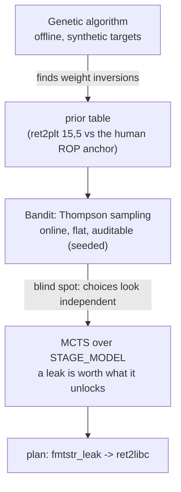

# Architecture: why rules-as-data

*Explanation. The design rationale.*

## The one decision that shapes everything

> **Separate what the target IS (facts) from what you DO about it (rules),
> and make both data.**

Everything else follows. The fact schema is a schema; the rules are rows;
the engine is an interpreter over the rows. That separation is what makes
an auditable decision layer possible at all:

- **Provenance**: only data can answer "which rule fired because of which
  facts" - a case statement cannot explain itself.
- **A second engine**: rules-as-data can be generated into a the frozen corpus .dl
  program, so a compiled Datalog engine and the Ruby engine can be
  conformance-tested against each other - the frozen corpus catches any
  drift between them.
- **The reverse reading**: "which protections kill which techniques" is
  a table traversal, not a code trace.

## The engine is boring on purpose

Forward-chaining fixpoint over a tiny rule set: derive tuples until nothing
new derives. No backtracking, no unification beyond equality, no cuts. The
entire semantics fits in one file and one afternoon of reading. Boring is
the point: auditable systems are systems a reviewer can finish.

Negation is stratified by convention (only on input facts) and enforced by
the corpus spec. Defaults are closed-world (`nx` absent means `nx("true")`)

- documented, tested, and the single most surprising line in the engine.

## Uncertainty, in three layers

A flat bandit ranks `ret2libc` above a leak; MCTS plans the leak first
because the transition table says what it unlocks. The planner's lesson,
as a diagram.

1. **Genetic algorithm (offline).** Evolved weight vectors over synthetic
   targets; found the inversions humans miss. Research tool, stays in
   Python - it is the narrative, not the SDK.
2. **Bandit (online, flat).** Thompson sampling over Beta posteriors.
   Adapts per target, remains auditable (seeded draws, logged feedback).
   Blind spot: treats choices as independent.
3. **MCTS (sequential).** Plans multi-step trajectories: a leak is worth
   what it unlocks, which no flat weight can express. The STAGE_MODEL is a
   transition table - data again, so the planner stays inspectable.

## Subprocesses are the API policy

SMT solvers, LLM providers: every external capability enters
through a serialization boundary (facts text, SMT-LIB text, HTTP). That is
what makes the zero-runtime-dependency gem possible, keeps native-extension
attack surface at zero, and lets a consumer swap bitwuzla for cvc5 or an
LLM backend without touching the core.

## New proposal sources, and why they do not change this

The profiler, the fuzzer's triage, and any future LLM feature extractor
all emit *facts* into the same boundary. A hypothetical LLM hypothesis
generator stays behind the whitelist: it proposes facts, the schema
rejects anything else, the engine never sees a prose sentence. The
architecture accepts new proposal sources because the contract was never
"trust the source"; it is "speak fact, or leave".
